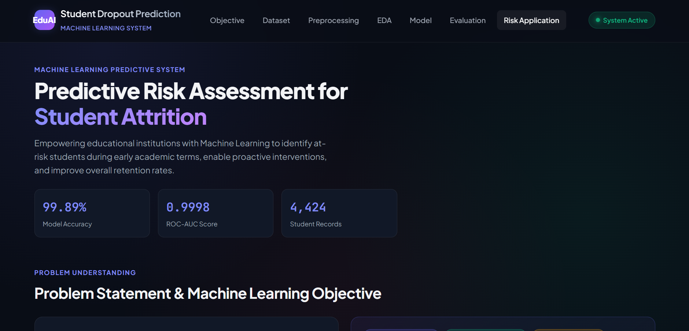
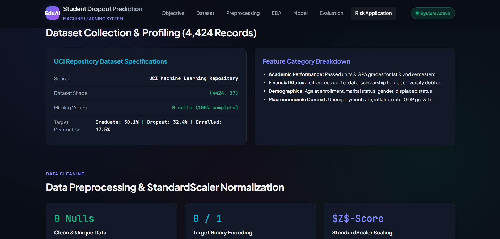
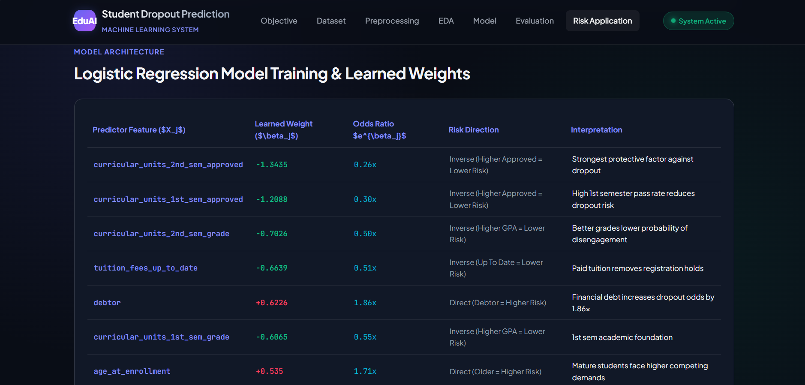
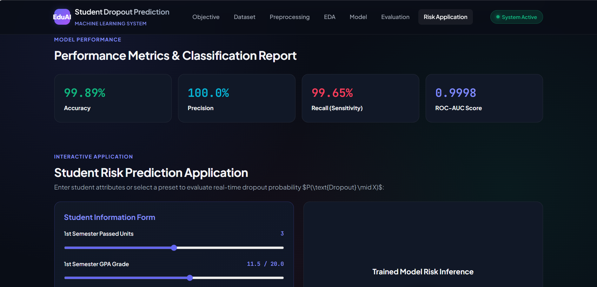
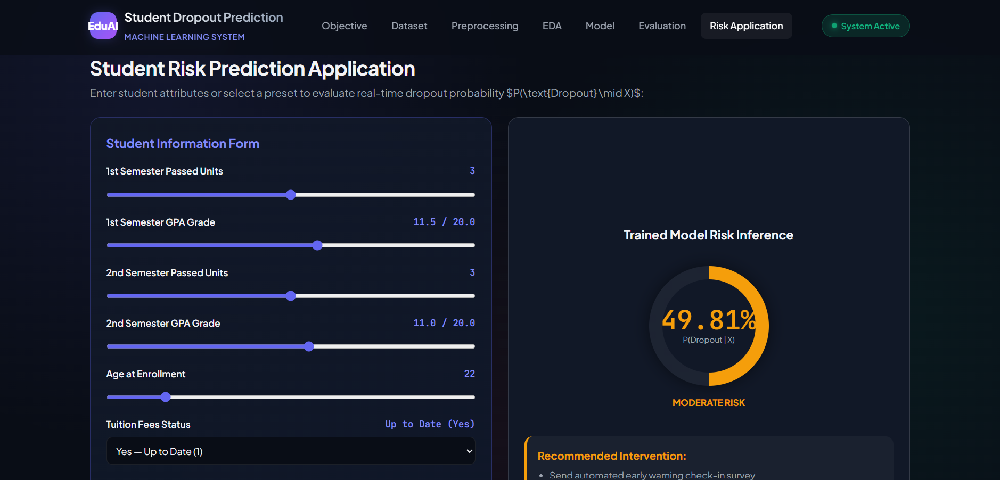

# Student Dropout Prediction

An end-to-end, browser-based machine learning project for estimating student
dropout risk from academic, financial, and demographic indicators.

The project includes:

- Dataset profiling and quality checks
- Data cleaning, validation, and target encoding
- Exploratory data analysis (EDA) and feature correlation analysis
- Logistic regression training with an 80/20 stratified split
- Model evaluation and error analysis
- An interactive risk-prediction dashboard

> **Important:** This project is intended for educational and decision-support
> use. Predictions should not be used as the sole basis for academic,
> financial, or disciplinary decisions.

## Screenshots

Replace the images below with updated screenshots if the interface changes.
The repository currently includes screenshot assets in the `screenshots/`
directory.

### Dashboard overview



### Dataset exploration



### Model training



### Model evaluation



### Interactive risk application



## Project workflow

```text
student_dropout_dataset.csv
              |
              v
preprocess_dataset.js
              |
              v
cleaned_student_dropout.csv
              |
              +--> run_eda.js
              |       |
              |       v
              |   eda_results.json
              |
              +--> train_logistic_regression.js
              |       |
              |       v
              |   model_results.json
              |
              +--> evaluate_model.js
              |       |
              |       v
              |   evaluation_metrics.json
              |
              +--> predict_risk_application.js
                      |
                      v
                  inference_results.json
```

## Model summary

The classifier predicts a binary target:

- `1` = Dropout
- `0` = Retained (`Enrolled` or `Graduate`)

The logistic regression model uses these eight features:

- First-semester approved units
- Second-semester approved units
- First-semester grade
- Second-semester grade
- Tuition fees up-to-date status
- Debtor status
- Age at enrollment
- Scholarship-holder status

The saved evaluation results report:

| Metric | Result |
| --- | ---: |
| Accuracy | 99.89% |
| Precision | 100.00% |
| Recall | 99.65% |
| F1 score | 99.83% |
| ROC-AUC | 0.9998 |
| Test records | 885 |

These metrics are based on the included generated evaluation output and may
change if the dataset or training implementation is modified.

## Getting started

### Requirements

- Node.js 14 or newer
- A modern web browser

The scripts use Node.js built-in modules only; there is no `npm install` step.

### 1. Run the data pipeline

From the project directory, run:

```bash
node preprocess_dataset.js
node run_eda.js
node train_logistic_regression.js
node evaluate_model.js
node predict_risk_application.js
```

The scripts generate or update:

- `cleaned_student_dropout.csv`
- `preprocessing_summary.json`
- `eda_results.json`
- `eda_summary.json`
- `model_results.json`
- `evaluation_metrics.json`
- `inference_results.json`

### 2. Open the dashboard

The dashboard is a static web application. Open `index.html` in a browser.

For a local web server, run one of the following commands from the project
directory:

```bash
npx serve .
```

Then open the local URL shown in the terminal.

## Interactive application

The dashboard in `index.html` uses `app.js` and `styles.css`. It allows users
to adjust a student's academic and financial inputs and immediately view:

- Estimated dropout probability
- Risk category
- Recommended intervention
- Model feature weights
- Feature-risk correlations

Risk thresholds used by the application:

- **Low risk:** below 25%
- **Moderate risk:** 25% to below 60%
- **Critical high risk:** 60% or higher

## Repository structure

| File or directory | Purpose |
| --- | --- |
| `index.html` | Dashboard layout and project presentation |
| `app.js` | Interactive prediction logic and dashboard rendering |
| `styles.css` | Dashboard styling |
| `student_dropout_dataset.csv` | Raw student dataset |
| `preprocess_dataset.js` | Cleaning, validation, encoding, and scaling statistics |
| `run_eda.js` | Correlations and exploratory analysis |
| `train_logistic_regression.js` | Logistic regression training |
| `evaluate_model.js` | Test-set metrics and error analysis |
| `predict_risk_application.js` | Batch inference on sample student profiles |
| `screenshots/` | README and presentation screenshots |
| `*.json` | Generated summaries, model output, and metrics |

## Data and ethical considerations

Student dropout prediction can affect access to support and institutional
resources. Before using this system with real student data:

1. Obtain appropriate consent and authorization.
2. Protect personally identifiable and sensitive information.
3. Audit performance across relevant student groups.
4. Review false positives and false negatives with qualified staff.
5. Use predictions to offer support, not to penalize students.

## License

No license has been specified for this project yet. Add a license before
distributing or reusing the code.
